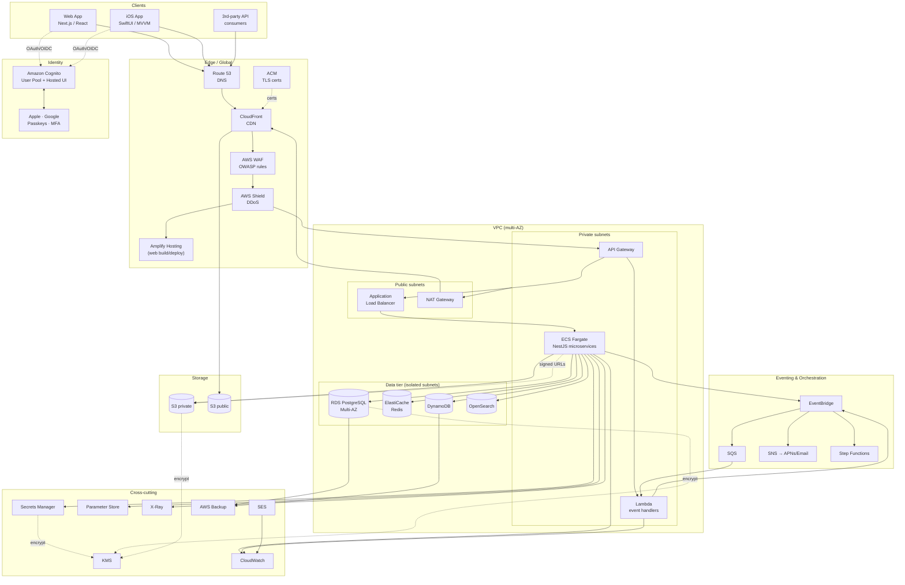
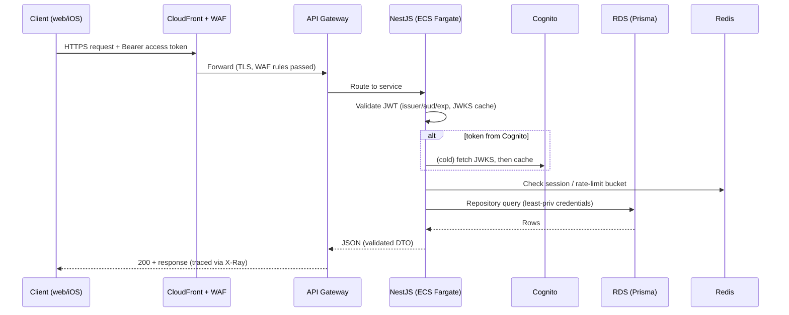

# CinneTemple — System Architecture

> Status: **Living document** · Owner: Platform · Last updated: 2026-06-27

CinneTemple is a cloud-native, AWS-only platform delivered across three clients
(web, iOS, and a public API) and built to the
[AWS Well-Architected Framework](https://aws.amazon.com/architecture/well-architected/)
pillars: operational excellence, security, reliability, performance efficiency,
cost optimization, and sustainability.

This document is the canonical description of how the system is shaped. Every
phase of implementation must remain consistent with it; when the design changes,
this file changes first.

---

## 1. Design principles

1. **AWS-native, single cloud.** No Firebase / Supabase / Vercel / Cloudflare
   Workers. Every runtime, datastore, and managed capability lives in AWS.
2. **Clean Architecture + DDD.** Domain logic is independent of frameworks and
   I/O. Adapters (HTTP, persistence, AWS SDK) sit at the edges. Dependencies
   point inward.
3. **Security by default.** Encryption in transit and at rest, least-privilege
   IAM, field-level encryption for PII, audit logging, WAF + Shield at the edge.
4. **Stateless services, stateful stores.** Compute scales horizontally; state
   lives in RDS, DynamoDB, S3, and ElastiCache.
5. **Everything as code.** Infrastructure (CDK), pipelines (CodePipeline /
   GitHub Actions), and configuration (Parameter Store / Secrets Manager) are
   versioned and reproducible across `dev`, `staging`, and `prod`.
6. **Observability is not optional.** Structured logs, metrics, traces (X-Ray),
   and alarms ship with every service from day one.

---

## 2. High-level component view

| Layer | Technology | Notes |
|-------|-----------|-------|
| Web | Next.js + React + TypeScript + Tailwind + Framer Motion | SSR/ISR, hosted on AWS Amplify Hosting, fronted by CloudFront. |
| iOS | SwiftUI + MVVM + Swift Concurrency + Amplify SDK | Offline cache, background sync, biometric login, push via SNS/APNs. |
| Edge | Route 53 + CloudFront + ACM + WAF + Shield | TLS termination, caching, DDoS protection, OWASP rule sets. |
| API | API Gateway → NestJS on ECS Fargate (+ Lambda for event glue) | REST + selective GraphQL, OpenAPI-documented. |
| Identity | Amazon Cognito (+ app-issued JWT/refresh) | Email, Apple, Google, Passkeys, MFA, RBAC. |
| Data | RDS PostgreSQL (Prisma), DynamoDB, OpenSearch, ElastiCache Redis | Relational core, high-velocity items, search, cache/sessions. |
| Storage | S3 (private + public buckets) + CloudFront signed URLs | Image/video optimization, CDN delivery. |
| Async | EventBridge + SQS + SNS + Step Functions | Domain events, queues, fan-out, orchestration. |
| Secrets | Secrets Manager + Parameter Store + KMS | Rotated secrets, encrypted config, customer-managed keys. |
| Observability | CloudWatch + X-Ray | Logs, metrics, dashboards, alarms, distributed tracing. |
| Resilience | AWS Backup + multi-AZ + cross-region DR | Automated backups, point-in-time recovery. |

---

## 3. AWS architecture diagram



---

## 4. Request lifecycle (authenticated API call)



---

## 5. Environments

| Env | Purpose | Isolation |
|-----|---------|-----------|
| `dev` | Day-to-day development, ephemeral data | Separate AWS account or VPC + cheap instance classes |
| `staging` | Pre-prod, prod-like, integration & load tests | Separate AWS account, prod-sized but scaled down |
| `prod` | Live traffic, millions of users | Dedicated account, multi-AZ, autoscaling, cross-region DR |

Preview environments are created per pull request for the web app (Amplify) and
for backend feature branches (ephemeral CDK stacks), then torn down on merge.

---

## 6. Cross-cutting concerns

- **AuthN/Z:** Cognito issues identity; the API verifies tokens and applies
  RBAC via guards. Roles: `guest`, `user`, `moderator`, `admin`.
- **Rate limiting:** Token-bucket per identity/IP in Redis, plus WAF rate rules.
- **Validation:** `class-validator` DTOs at the HTTP edge; domain invariants in
  entities; Zod contracts shared with clients via `packages/shared`.
- **Auditing:** Every state-changing action writes an immutable `audit_log` row
  and emits an EventBridge event.
- **Encryption:** TLS 1.2+ everywhere; KMS CMKs for RDS, S3, Secrets, DynamoDB;
  field-level encryption for PII columns (see `DATABASE.md`).
- **Observability:** JSON logs with correlation IDs, RED/USE metrics, X-Ray
  traces, CloudWatch alarms → SNS → on-call.
- **Resilience:** Multi-AZ RDS with automated failover, PITR, AWS Backup plans,
  and documented cross-region restore runbooks.

---

## 7. Repository topology

See [`REPO_STRUCTURE.md`](./REPO_STRUCTURE.md) for the full tree. Summary:

```
apps/        web (Next.js) · ios (SwiftUI) · backend (NestJS)
packages/    shared (types/contracts) · ui · sdk · config
infrastructure/  cdk (primary IaC) · terraform (optional)
docs/        architecture · database · api · roadmap · context
```

---

## 8. Related documents

- [`DATABASE.md`](./DATABASE.md) — data model, Prisma schema, encryption, audit.
- [`API.md`](./API.md) — REST/GraphQL surface and OpenAPI for Phase 1 auth.
- [`ROADMAP.md`](./ROADMAP.md) — phased delivery plan.
- [`REPO_STRUCTURE.md`](./REPO_STRUCTURE.md) — directory layout.
- [`PROJECT_CONTEXT.md`](./PROJECT_CONTEXT.md) — running build log / decisions.
