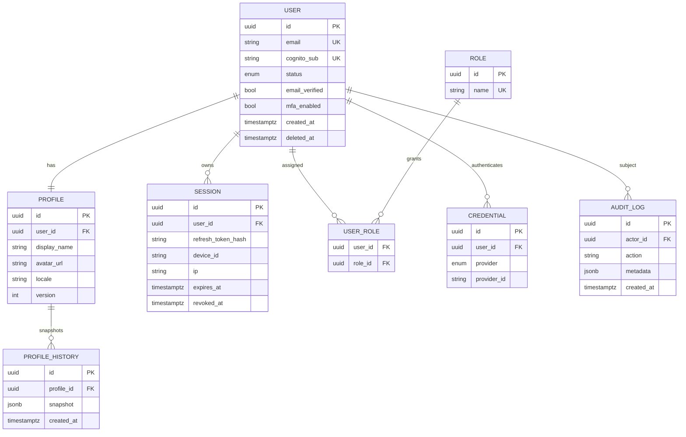

# CinneTemple — Database Design (Phase 1: Identity & Access)

> Datastore: **Amazon RDS for PostgreSQL 16**, accessed via **Prisma ORM**.
> Conventions: soft delete, audit logging, version history, explicit indexes,
> field-level encryption for PII.

The relational core models identity, profiles, sessions, roles, and audit. High
-velocity, append-only data (e.g. token denylist, rate-limit counters) lives in
DynamoDB / Redis rather than Postgres.

---

## 1. Conventions

- **Primary keys:** UUID v7 (time-ordered) stored as `uuid`.
- **Timestamps:** `created_at`, `updated_at` (UTC, `timestamptz`).
- **Soft delete:** `deleted_at timestamptz NULL`; queries filter it out by default
  via Prisma middleware. Hard deletes are reserved for GDPR erasure flows.
- **Audit:** every mutation appends to `audit_log` with actor, action, before/after.
- **Versioning:** mutable aggregates carry an integer `version` for optimistic
  concurrency; profile changes also snapshot into `profile_history`.
- **Field-level encryption:** PII columns (e.g. `phone_number`) are encrypted
  application-side with a KMS data key (envelope encryption) before persistence.
- **Indexes:** every foreign key and every common filter/sort column is indexed.

---

## 2. Entity-relationship overview



---

## 3. Prisma schema (Phase 1)

The authoritative schema lives at
[`apps/backend/prisma/schema.prisma`](../apps/backend/prisma/schema.prisma).
It is reproduced here for review:

```prisma
generator client {
  provider = "prisma-client-js"
}

datasource db {
  provider = "postgresql"
  url      = env("DATABASE_URL")
}

enum UserStatus {
  PENDING_VERIFICATION
  ACTIVE
  SUSPENDED
  DEACTIVATED
}

enum AuthProvider {
  EMAIL
  APPLE
  GOOGLE
  PASSKEY
}

model User {
  id            String     @id @default(uuid()) @db.Uuid
  email         String     @unique
  cognitoSub    String?    @unique @map("cognito_sub")
  status        UserStatus @default(PENDING_VERIFICATION)
  emailVerified Boolean    @default(false) @map("email_verified")
  mfaEnabled    Boolean    @default(false) @map("mfa_enabled")
  phoneNumberEnc Bytes?    @map("phone_number_enc") // KMS-encrypted PII

  profile     Profile?
  sessions    Session[]
  roles       UserRole[]
  credentials Credential[]
  auditLogs   AuditLog[]   @relation("AuditActor")

  version   Int       @default(1)
  createdAt DateTime  @default(now()) @map("created_at")
  updatedAt DateTime  @updatedAt @map("updated_at")
  deletedAt DateTime? @map("deleted_at")

  @@index([status])
  @@index([deletedAt])
  @@map("users")
}

model Profile {
  id          String  @id @default(uuid()) @db.Uuid
  userId      String  @unique @map("user_id") @db.Uuid
  user        User    @relation(fields: [userId], references: [id], onDelete: Cascade)
  displayName String  @map("display_name")
  avatarUrl   String? @map("avatar_url")
  locale      String  @default("en")
  bio         String?

  history   ProfileHistory[]
  version   Int       @default(1)
  createdAt DateTime  @default(now()) @map("created_at")
  updatedAt DateTime  @updatedAt @map("updated_at")
  deletedAt DateTime? @map("deleted_at")

  @@map("profiles")
}

model ProfileHistory {
  id        String   @id @default(uuid()) @db.Uuid
  profileId String   @map("profile_id") @db.Uuid
  profile   Profile  @relation(fields: [profileId], references: [id], onDelete: Cascade)
  snapshot  Json
  createdAt DateTime @default(now()) @map("created_at")

  @@index([profileId])
  @@map("profile_history")
}

model Session {
  id               String    @id @default(uuid()) @db.Uuid
  userId           String    @map("user_id") @db.Uuid
  user             User      @relation(fields: [userId], references: [id], onDelete: Cascade)
  refreshTokenHash String    @map("refresh_token_hash") // SHA-256 of refresh token
  deviceId         String?   @map("device_id")
  userAgent        String?   @map("user_agent")
  ip               String?
  expiresAt        DateTime  @map("expires_at")
  revokedAt        DateTime? @map("revoked_at")
  createdAt        DateTime  @default(now()) @map("created_at")

  @@index([userId])
  @@index([refreshTokenHash])
  @@index([expiresAt])
  @@map("sessions")
}

model Role {
  id        String     @id @default(uuid()) @db.Uuid
  name      String     @unique
  users     UserRole[]
  createdAt DateTime   @default(now()) @map("created_at")

  @@map("roles")
}

model UserRole {
  userId String @map("user_id") @db.Uuid
  roleId String @map("role_id") @db.Uuid
  user   User   @relation(fields: [userId], references: [id], onDelete: Cascade)
  role   Role   @relation(fields: [roleId], references: [id], onDelete: Cascade)

  @@id([userId, roleId])
  @@map("user_roles")
}

model Credential {
  id         String       @id @default(uuid()) @db.Uuid
  userId     String       @map("user_id") @db.Uuid
  user       User         @relation(fields: [userId], references: [id], onDelete: Cascade)
  provider   AuthProvider
  providerId String       @map("provider_id")
  createdAt  DateTime     @default(now()) @map("created_at")

  @@unique([provider, providerId])
  @@index([userId])
  @@map("credentials")
}

model AuditLog {
  id        String   @id @default(uuid()) @db.Uuid
  actorId   String?  @map("actor_id") @db.Uuid
  actor     User?    @relation("AuditActor", fields: [actorId], references: [id], onDelete: SetNull)
  action    String
  entity    String?
  entityId  String?  @map("entity_id")
  metadata  Json?
  ip        String?
  createdAt DateTime @default(now()) @map("created_at")

  @@index([actorId])
  @@index([action])
  @@index([createdAt])
  @@map("audit_log")
}
```

---

## 4. Non-relational stores

| Store | Use | Why not Postgres |
|-------|-----|------------------|
| DynamoDB `token_denylist` | Revoked/blacklisted JWT IDs with TTL | High write volume, TTL auto-expiry |
| Redis (ElastiCache) | Rate-limit buckets, JWKS cache, hot sessions | Sub-ms latency, ephemeral |
| OpenSearch | User/audit search (admin tooling) | Full-text + aggregations |
| S3 | Avatars, media | Object storage + CDN |

---

## 5. Migrations & seeding

- Migrations are managed by `prisma migrate` (`prisma/migrations/**`), applied in
  CI/CD before deploy.
- Seed data (`prisma/seed.ts`) creates the baseline roles (`user`, `moderator`,
  `admin`) and a local dev admin.
- Backups: RDS automated snapshots + AWS Backup plan; PITR enabled; restore
  runbook in `docs/` (DR section of `ROADMAP.md`).
