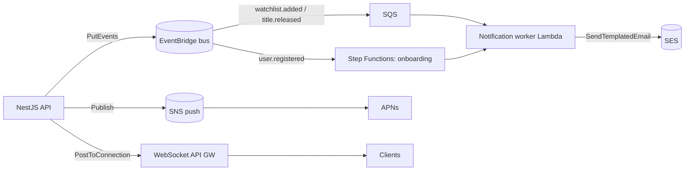

# CinneTemple — Eventing, Notifications & Realtime (Phase 3)

The async backbone that turns domain actions into emails, push notifications, and
live in-app updates — all AWS-native.

## Domain events

The backend publishes domain events through an `EventBus` abstraction
(`EVENTS_DRIVER`): `local` logs (offline dev); `eventbridge` emits to the
`cinnetemple` EventBridge bus. Current events: `user.registered`,
`user.verified`, `watchlist.added`, `title.released`.

## Step Functions onboarding

`user.registered` triggers the **onboarding** state machine: send the welcome
email (SES template, via the worker Lambda) → wait one day → succeed (extend with
tips/retention nudges). Defined in `MessagingStack`.

## SQS worker

Events needing fan-out processing route EventBridge → **SQS** (with a DLQ,
maxReceiveCount 5) → **notification worker Lambda**. The worker is idempotent per
message and sends templated SES email; failures land in the DLQ for replay.

## Push notifications (SNS → APNs / web)

Clients register a device token at `POST /v1/notifications/devices`. The backend
(`PushService`, `PUSH_DRIVER`) creates an SNS platform endpoint and stores it on
the `DeviceToken` row; `notifyUser` publishes to all of a user's endpoints.
`local` driver logs. The APNs **platform application** must be created with your
APNs auth key and its ARN supplied as `SNS_PLATFORM_APP_ARN` (not created by CDK
because it needs your signing key).

### iOS

`PushManager` requests authorization after sign-in, registers with APNs via a
`UIApplicationDelegateAdaptor`, and sends the hex token to the backend. Requires
the **Push Notifications** capability and a Background Mode of *Remote
notifications* in Xcode.

## SES templates

`CinneTempleWelcome` and `CinneTempleNewRelease` are managed `AWS::SES::Template`
resources (in `MessagingStack`). The backend `MailService.sendTemplated` and the
worker Lambda both render them. Note: SES starts in sandbox mode — verify the
sender domain and request production access before sending to arbitrary users.

## Realtime (WebSocket API Gateway)

`RealtimeStack` provisions a WebSocket API with `$connect` / `$disconnect` /
`$default` Lambdas and a TTL-expiring DynamoDB **connections** table. The backend
`RealtimeService` pushes messages to a connection via the API Gateway management
API (`REALTIME_ENDPOINT`). The web client uses the `useRealtime` hook
(`NEXT_PUBLIC_REALTIME_URL`) with auto-reconnect; the nav `NotificationBell`
reflects live status and new-message state.

## Local development

Every driver defaults to `local`, so the full app runs offline: events and pushes
are logged, emails print to the backend log, and the realtime hook simply stays
idle without `NEXT_PUBLIC_REALTIME_URL`. Flip the `*_DRIVER` env vars (set from
CDK outputs) to light up the AWS paths.
